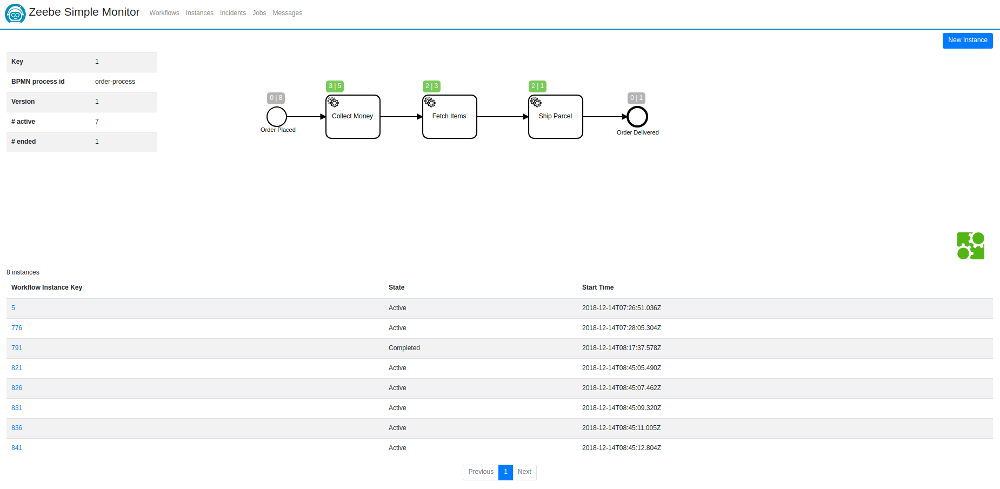
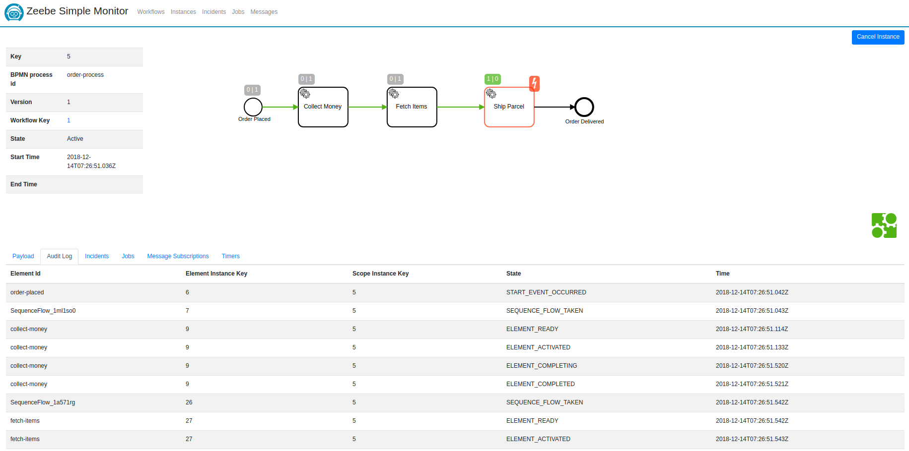

Zeebe Simple Monitor
=========================

This is a monitoring application for [Zeebe](https://zeebe.io). It has two parts: an [exporter](https://github.com/zeebe-io/zeebe-simple-monitor/exporter) and a [web application](https://github.com/zeebe-io/zeebe-simple-monitor/app). The exporter runs on the Zeebe broker and export data to a database. The webapp reads the data from the database and present it in a HTML5 web application.

**Important notes:**
* The simple monitor is a community project meant for playing around with Zeebe. **Consider it unstable! There is no guranteed maintenance! It is not officially supported by the Zeebe Team!** But of course everybody is invited to contribute!
* The simple monitor is tested on **Chrome only**. Other browsers are not supported.

**Features:**
* inspect deployed workflows
* inspect workflow instances, including payload and incidents
* management operations (e.g. new deployment, cancel workflow instance, update payload)

## How to run

### With Docker

The following command will build the project, pull images and start containers with default settings.

In your terminal (in the root project folder):

```bash
docker/run
```
Note: You can build the project with maven in a containerized environ by commenting the line 14 and uncommenting the line 15 in the `docker/run` file.
If you don't have the right to launch `docker/run` try : 

```bash
chmod +x docker/run
```
and try again.

### Manually

#### How to build

1. Build with Maven

		`mvn clean install`

2. Before you start the broker, copy the exporter JAR from the target folder into the lib folder of the broker.

		```
		cp exporter/target/zeebe-simple-monitor-exporter-%{VERSION}.jar ~/zeebe-broker-%{VERSION}/lib/
		```
		
		If you don't use the Hazelcast exporter yet then download the [Hazelcast exporter jar](https://github.com/zeebe-io/zeebe-hazelcast-exporter/releases) and copy it also into the lib folder.

3. Register the exporters in the Zeebe configuration file `~/zeebe-broker-%{VERSION}/config/zeebe.cfg.toml`.

		```
		[[exporters]]
		id = "simple-monitor"
		className = "io.zeebe.monitor.SimpleMonitorExporter"
		
		[[exporters]]
		id = "hazelcast"
		className = "io.zeebe.hazelcast.exporter.HazelcastExporter"
		```

4. Now start the broker and the webapp

		`java -jar app/target/zeebe-simple-monitor-app-{VERSION}.jar`

5. Open a web browser and go to http://localhost:8080

> The default configuration uses a file-based H2 database and works if the broker and the webapp runs on the same machine. See the [exporter](https://github.com/zeebe-io/zeebe-simple-monitor/tree/master/exporter#configure-the-exporter) and the [web application](https://github.com/zeebe-io/zeebe-simple-monitor/tree/master/app#configuration) for more configuration options.

## Screenshots

**Workflow View**



**Workflow Instance View**



## Code of Conduct

This project adheres to the Contributor Covenant [Code of
Conduct](/CODE_OF_CONDUCT.md). By participating, you are expected to uphold
this code. Please report unacceptable behavior to code-of-conduct@zeebe.io.

## License

[Apache License, Version 2.0](/LICENSE) 

[broker-core]: https://github.com/zeebe-io/zeebe/tree/master/broker-core
[agpl]: https://github.com/zeebe-io/zeebe/blob/master/GNU-AGPL-3.0
